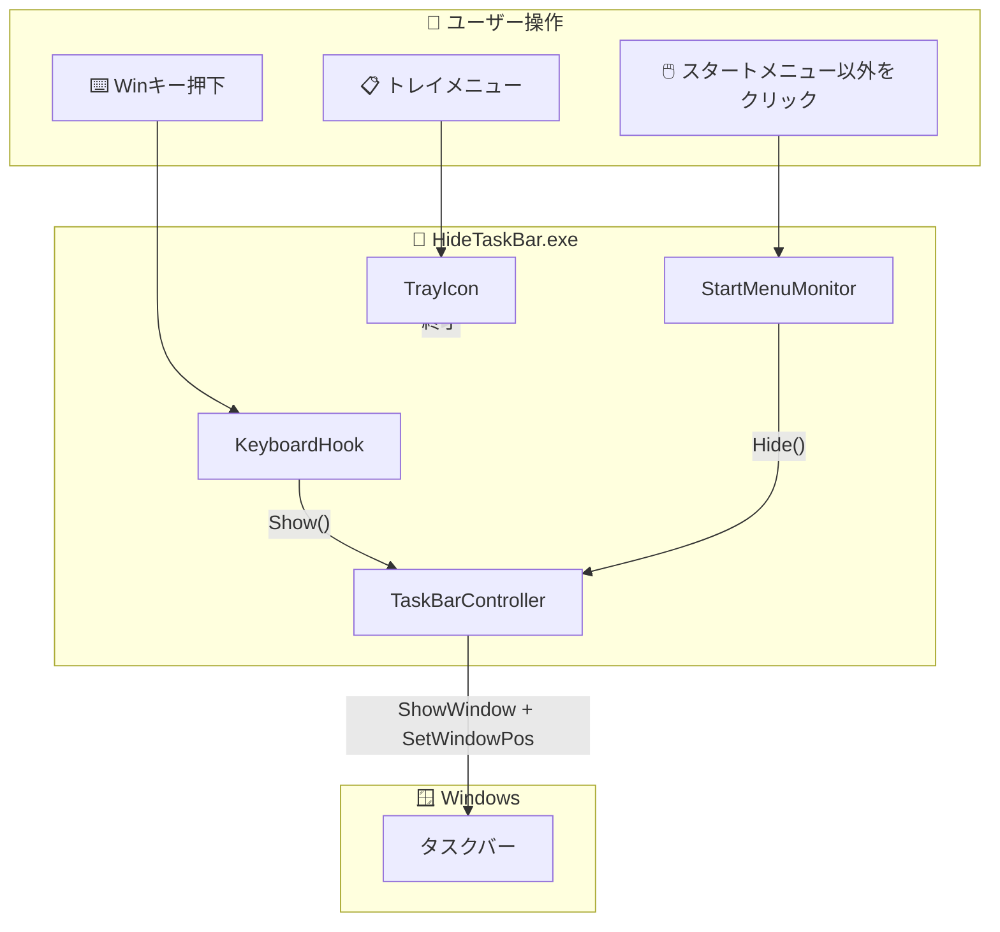
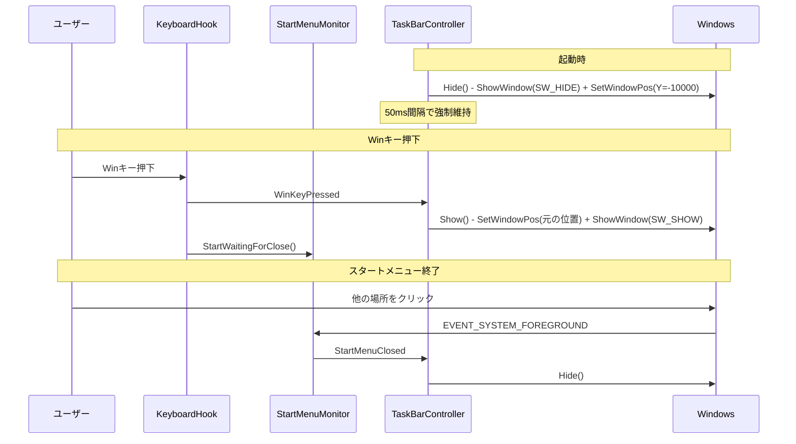
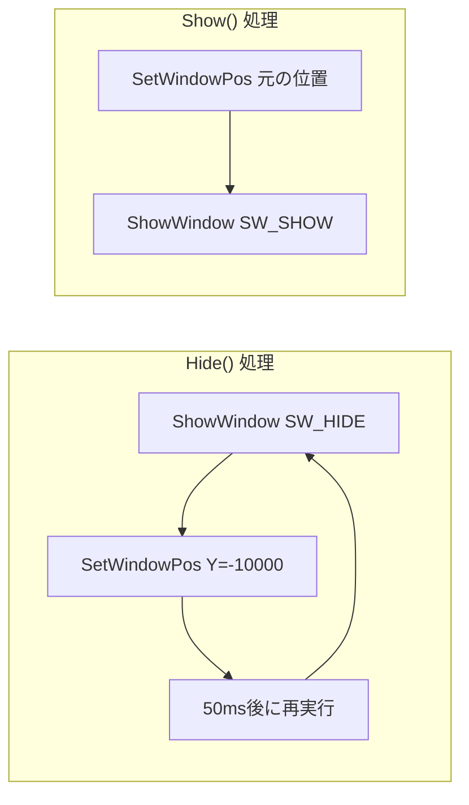
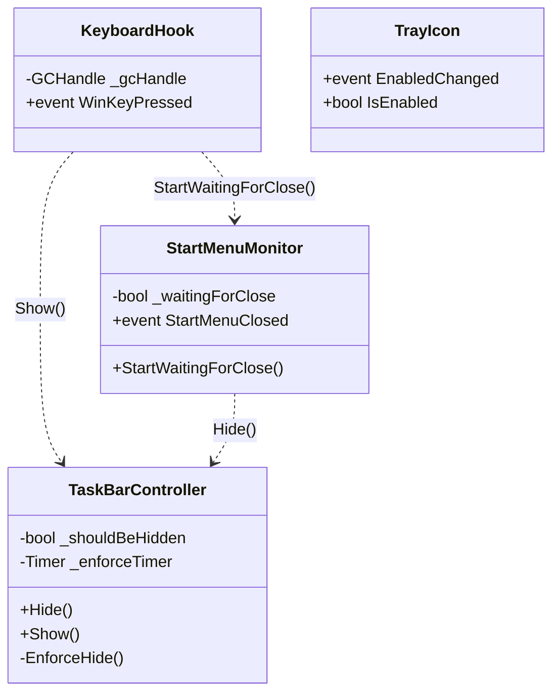

# HideTaskBar - アーキテクチャ設計

## システム概要

---

## イベントフロー

---

## タスクバー非表示の仕組み

**2つのAPIを併用する理由:**
- `ShowWindow(SW_HIDE)`: ウィンドウを非表示にし、マウスホバー判定を無効化
- `SetWindowPos(Y=-10000)`: 念のため画面外に移動してバックアップ

---

## コンポーネント構成

---

## Win32 API 使用一覧

| コンポーネント | API | 用途 |
|----------------|-----|------|
| TaskBarController | `FindWindow` | タスクバーハンドル取得 |
| TaskBarController | `ShowWindow` | 表示/非表示切り替え |
| TaskBarController | `SetWindowPos` | 位置移動 |
| KeyboardHook | `SetWindowsHookEx` | キーボードフック |
| StartMenuMonitor | `SetWinEventHook` | フォアグラウンド変更監視 |

---

## 機能要件マッピング

| 要件 | 実装 |
|------|------|
| FR-1 | `ShowWindow(SW_HIDE)` + `SetWindowPos(Y=-10000)` 50ms間隔強制 |
| FR-2 | `WH_KEYBOARD_LL` フック |
| FR-3 | `EVENT_SYSTEM_FOREGROUND` 監視 |
| FR-4 | `NotifyIcon` + コンテキストメニュー |
| FR-5 | トレイメニュー「有効/無効」 |
| FR-6 | レジストリ `HKCU\...\Run` |
| FR-7 | `Shell_SecondaryTrayWnd` 対応 |
