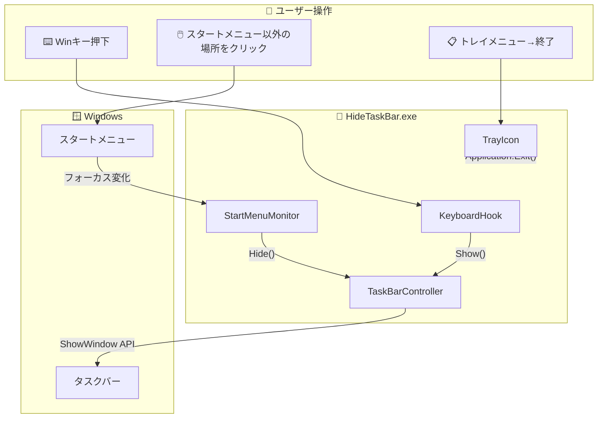
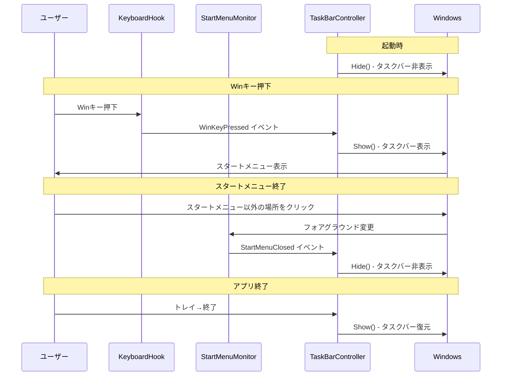
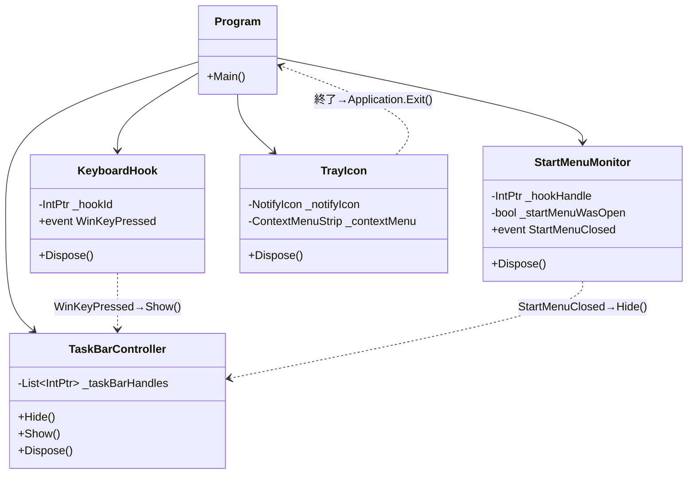
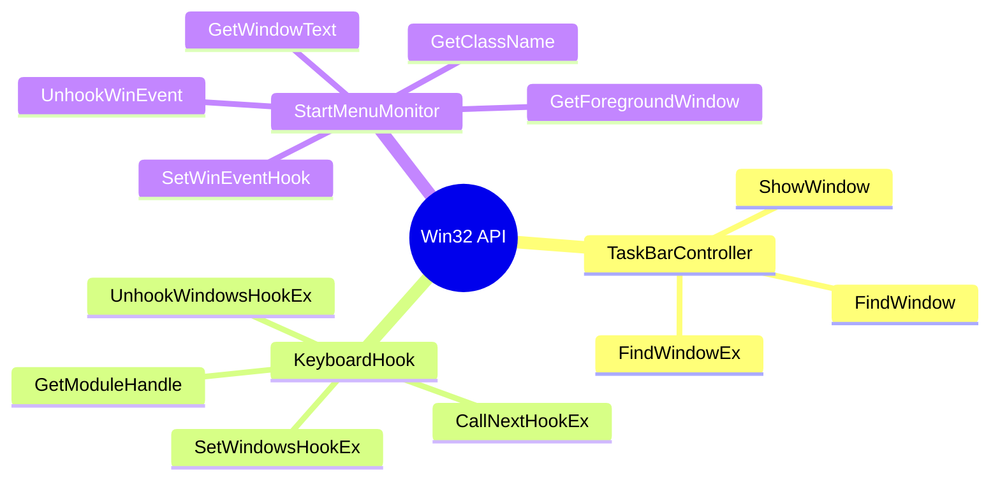

# HideTaskBar - アーキテクチャ設計

## システム概要

---

## イベントフロー

---

## コンポーネント構成

---

## Win32 API 使用一覧

---

## 機能要件マッピング

| 要件 | コンポーネント | 実装 |
|------|----------------|------|
| FR-1 | TaskBarController | `ShowWindow(hwnd, SW_HIDE)` |
| FR-2 | KeyboardHook | `WH_KEYBOARD_LL` フック |
| FR-3 | StartMenuMonitor | `EVENT_SYSTEM_FOREGROUND` 監視 |
| FR-4 | TrayIcon | `NotifyIcon` + コンテキストメニュー |
